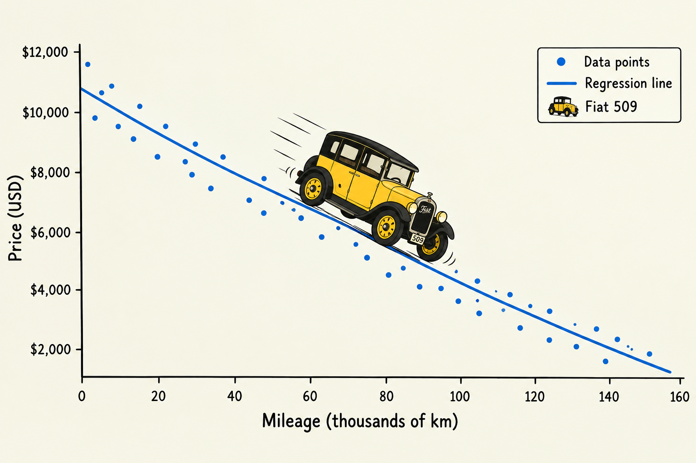
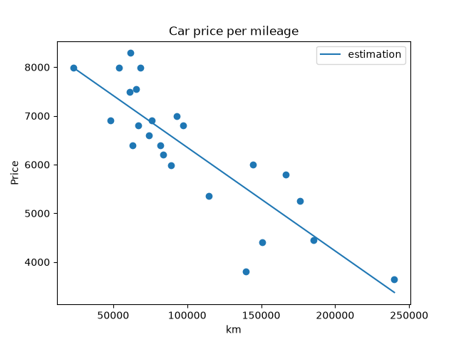
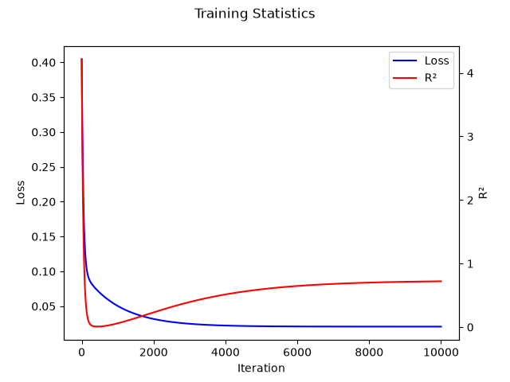

# FtLinearRegression

Developed during the 18th century to solve astronomical and geodetic problems, linear regression is one of the simplest yet most powerful methods in statistics. It is widely used nowadays in the natural and social sciences – including epidemiology – as well as in finance and machine learning.

Linear regression models estimate the relationship between one or more independent variables and a dependent variable. In its simplest form, the goal is to find the line that best fits the observed data and helps describe the relationship between the variables.

Although several estimation methods have been developed, Ordinary Least Squares (OLS) is the most commonly used. It was first published in 1805 by Adrien-Marie Legendre in his **_Nouvelles méthodes pour la détermination des orbites des comètes_**. Karl Friedrich Gauss later claimed that he had already been using the method since 1795, notably in connection with his work on the orbit of Ceres.

Here, we will apply a simple linear regression model to a much more trivial, but hopefully useful, problem: How much worse is my old car getting?



## Summary

ft_linear_regression is a simple Python program that predicts the price of a car based on its mileage using a linear regression model.

### Training

`ft_training` trains a simple linear regression model using the provided mileage and price data.
It uses the Ordinary Least Squares (OLS) method, with gradient descent to estimate the model parameters.

The program also generates plots showing the fitted regression line and the data, as well as the evolution of the MSE and $R^2$ throughout the training process.

### Prediction

`ft_predict` predicts the price of a car given its mileage, using the parameters computed by `ft_training`.

## Usage

### Dependencies

The programs use the pandas, numpy and matplotlib libraries.
If necessary, create a virtual environment to install them.

#### Check if venv is installed

```sh
python3 -m venv --help
```

If not, install it.
For Debian:

```sh
sudo apt update
sudo apt install python3-venv
```

#### Create the virtual environement

```sh
cd /path/to/ft_linear_regression
python3 -m venv .venv
source .venv/bin/activate
```

#### Install the required modules

```sh
pip install pandas numpy matplotlib
```

### Training Programm

Run with:

```sh
python3 -m src.ft_training tests/data/data.csv
```

Expected output:

```sh
(.venv) ➜  ft_linear_regression git:(dev) ✗ python3 -m src.ft_training tests/data/data.csv
Parameters: Theta 0: 8480.966554681116, Theta 1: -0.021271757648460635
Normalized Loss: 0.020703090879491397
Loss: 445729.26539909816
R²: 0.7209137463879318


```

The training program creates a `thetas.txt` file containing the estimated model parameters.

Three plots are also generated for the statistics:

- `carprices.png`: shows the regression line plotted against the original dataset.
- `normalized.png`: shows the regression line plotted against the normalized data.
- `stats.png`: shows the evolution of MSE and $R2$ throughout the training process.

#### carprices.png



#### stats.png



File names can be modified in `src/config.py`

#### Gradient Descent Configuration

By default, the gradient descent algorithm uses the following parameters:

- step size (DEFAULT_STEP): 0.01
- number of iterations (LOOPS): 10000

Both parameters can be configured in `src/config.py`

### Prediction Program

```sh
python3 -m src.ft_predict <mileage> <parameters_file.txt>
```

If no file is provided, the file `./thetas.txt`, generated by the training program, will be used.

## Data Format

### Dataset

The training program requires a dataset provided as a csv file.
The first column will be the mileage, the second column the price.
Empty values are not allowed.
Here an exemple:

```csv
km,price
240000,3650
139800,3800
150500,4400
185530,4450
176000,5250
114800,5350
```

### Thetas

The prediction program requires the theta parameters provided in a text file.
Theta0 will be provided on the first line ; Theta1 on the second line.
Here an exemple:

```
1234
42
```

## Unit Test

This project has a full set of unit test. They can be run with:

```sh
python3 -m unittest discover -s tests
```

## Math

### Normalization

Data are first normalized using the formula:

$$
z = \frac{x - min(x)}{max(x) - min(x)}
$$

### Learning

$\theta_0$ and $\theta_1$ are initialized to 0 then updated according to:

$$
\theta_0 \gets \theta_0 - \alpha \frac{1}{N} \sum_{i=1}^{N} \left( \hat{y_i} - y_i \right)
$$

$$
\theta_1 \gets \theta_1 - \alpha \frac{1}{N} \sum_{i=1}^{N} \left( \hat{y_i} - y_i  \right) x_i
$$

with:

$$
\hat{y_i} = \theta_0 + \theta_1 x_i
$$

### Estimation

#### Loss (Mean Squared Error)

The Mean Squared Error (MSE) measures the average squared difference between the predicted and actual values. It quantifies how far the predictions are from the observations: the lower the MSE, the closer the predictions are to the data.

$$
MSE = \frac{1}{N} \sum_{i=1}^{N} \left( \hat{y_i} - y_i \right) ^2
$$

#### Coefficient of Determination $R^2$

$R^2$ indicates the proportion of the total variation in $y$ that is explained by the regression model. It ranges from 0 to 1, where 1 indicates a perfect fit and 0 means the model explains none of the observed variance.

$$
R^2 = \frac{\sum_{i=1}^{N} \left( \hat{y_i} - \bar{y}  \right) ^2 }{ \sum_{i=1}^{N} \left( y_i - \bar{y}  \right) ^2 }
$$

with:

$$
\bar{y} = \frac{1}{N} \sum_{1}^{N} y_i
$$
